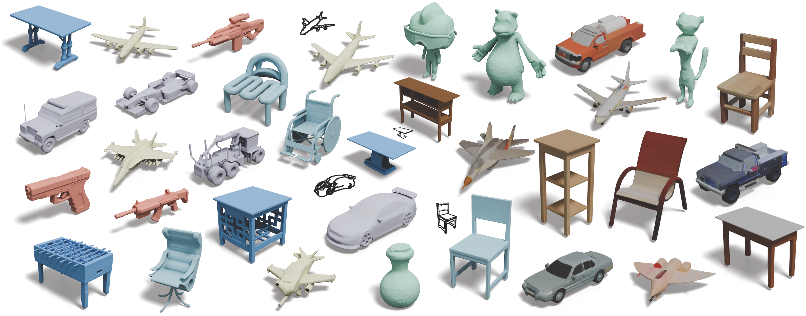

# OctFusion: Octree-based Diffusion Models for 3D Shape Generation
[[`arXiv`](https://arxiv.org/abs/2212.04493)]
[[`Project Page`](https://yccyenchicheng.github.io/SDFusion/)]
[[`BibTex`](#citation)]

Code release for the paper "OctFusion: Octree-based Diffusion Models for 3D Shape Generation".




## 1. Installation
1. Create a `Conda` environment.
```bash
conda create -n octfusion python=3.9 -y && conda activate octfusion
```

2. Install PyTorch with Conda
```bash
conda install pytorch torchvision torchaudio pytorch-cuda=12.1 -c pytorch -c nvidia
```

3. Clone this repository and install other requirements.
```bash
git clone 
cd OctFusion
pip3 install -r requirements.txt 
```

## 2. Generation with pre-trained models

### 2.1 Download pre-trained models
We provide the pretrained models for the category-conditioned generation and sketch-conditioned generation. Please download the pretrained models from [Google Drive](https://drive.google.com/drive/folders/1mN6iZ-NHAkSyQ526bcoECiDrDSx4zL9B?usp=sharing) and put them in `saved_ckpt/`.

### 2.2 Generation
1. Unconditional generation
```
sh scripts/gen_snet_uncond.sh
```

2. Category-conditioned generation
```
sh scripts/gen_snet_cond.sh
```

## 3. Train from scratch
### 3.1 Data Preparation

1. Download `ShapeNetCore.v1.zip` (31G) from [ShapeNet](https://shapenet.org/) and place it into the folder `data/ShapeNet`.

2. Convert the meshes in `ShapeNetCore.v1` to signed distance fields (SDFs).

```bash
python tools/shapenet.py --run convert_mesh_to_sdf
```
We use the same data preparation as [DualOctreeGNN](https://github.com/microsoft/DualOctreeGNN.git). Note that this process is relatively slow, it may take several days to finish converting all the meshes from ShapeNet. 


### How to train the SDFusion


# <a name="citation"></a> Citation

If you find this code helpful, please consider citing:

1. Conference version
```BibTeX
@inproceedings{cheng2023sdfusion,
  author={Cheng, Yen-Chi and Lee, Hsin-Ying and Tuyakov, Sergey and Schwing, Alex and Gui, Liangyan},
  title={{SDFusion}: Multimodal 3D Shape Completion, Reconstruction, and Generation},
  booktitle={CVPR},
  year={2023},
}
```
2. arxiv version
```BibTeX
@article{cheng2022sdfusion,
  author = {Cheng, Yen-Chi and Lee, Hsin-Ying and Tuyakov, Sergey and Schwing, Alex and Gui, Liangyan},
  title = {{SDFusion}: Multimodal 3D Shape Completion, Reconstruction, and Generation},
  journal = {arXiv},
  year = {2022},
}
```

# <a name="issue"></a> Issues and FAQ
Coming soon!

# Acknowledgement
This code borrows heavely from [SDFusion](https://github.com/yccyenchicheng/SDFusion), [LAS-Diffusion](https://github.com/Zhengxinyang/LAS-Diffusion), [DualOctreeGNN](https://github.com/microsoft/DualOctreeGNN). We thank the authors for their great work. The followings packages are required to compute the SDF: [mesh2sdf](https://github.com/wang-ps/mesh2sdf).
